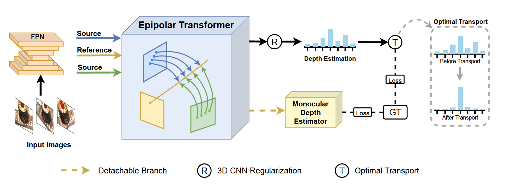

# MVSTER
MVSTER: Epipolar Transformer for Efficient Multi-View Stereo, ECCV 2022. [arXiv](https://arxiv.org/abs/2204.07346)

This repository contains the official implementation of the paper: "MVSTER: Epipolar Transformer for Efficient Multi-View Stereo".


## Introduction
MVSTER is a learning-based MVS method which achieves competitive reconstruction performance with significantly higher efficiency. MVSTER leverages the proposed epipolar Transformer to learn both 2D semantics and 3D spatial associations efficiently. Specifically, the epipolar Transformer utilizes a detachable monocular depth estimator to enhance 2D semantics and uses cross-attention to construct data-dependent 3D associations along epipolar line. Additionally, MVSTER is built in a cascade structure, where entropy-regularized optimal transport is leveraged to propagate finer depth estimations in each stage.



## Installation
MVSTER is tested on:
* python 3.7
* CUDA 11.1
### Requirements
```
pip install -r requirements.txt
```

## Training
* Dowload [DTU dataset](https://roboimagedata.compute.dtu.dk/). For convenience, can download the preprocessed [DTU training data](https://drive.google.com/file/d/1eDjh-_bxKKnEuz5h-HXS7EDJn59clx6V/view)
 and [Depths_raw](https://virutalbuy-public.oss-cn-hangzhou.aliyuncs.com/share/cascade-stereo/CasMVSNet/dtu_data/dtu_train_hr/Depths_raw.zip) 
 (both from [Original MVSNet](https://github.com/YoYo000/MVSNet)), and upzip it as the $DTU_TRAINING folder. For training and testing with raw image size, you can download [Rectified_raw](http://roboimagedata2.compute.dtu.dk/data/MVS/Rectified.zip), and unzip it.

```                
├── Cameras    
├── Depths
├── Depths_raw   
├── Rectified
├── Rectified_raw (Optional)                                      
```
In ``scripts/train_dtu.sh``, set ``DTU_TRAINING`` as $DTU_TRAINING

Train MVSTER (Multi-GPU training): 
* Train with middle size (512x640):
```
bash ./scripts/train_dtu.sh mid exp_name
```
* Train with raw size (1200x1600):
```
bash ./scripts/train_dtu.sh raw exp_name
```
After training, you will get model checkpoints in ./checkpoints/dtu/exp_name.

## Testing
* Download the preprocessed test data [DTU testing data](https://drive.google.com/open?id=135oKPefcPTsdtLRzoDAQtPpHuoIrpRI_) (from [Original MVSNet](https://github.com/YoYo000/MVSNet)) and unzip it as the $DTU_TESTPATH folder, which should contain one ``cams`` folder, one ``images`` folder and one ``pair.txt`` file.
* In ``scripts/test_dtu.sh``, set ``DTU_TESTPATH`` as $DTU_TESTPATH.
* The ``DTU_CKPT_FILE`` is automatically set as your pretrained checkpoint file, you also can download my [pretrained model](https://github.com/JeffWang987/MVSTER/releases/tag/dtu_ckpt).
* Test with middle size:
```
bash ./scripts/test_dtu.sh mid exp_name
```
* Test with raw size:
```
bash ./scripts/test_dtu.sh raw exp_name
```
* Test with provided pretrained model:
```
bash scripts/test_dtu.sh mid benchmark --loadckpt PATH_TO_CKPT_FILE
```
After testing, you will get reconstructed point clouds of DTU test set in ./outputs/dtu/exp_name.

## Metric
* For quantitative evaluation, download [SampleSet](http://roboimagedata.compute.dtu.dk/?page_id=36) and [Points](http://roboimagedata.compute.dtu.dk/?page_id=36) from DTU's website. Unzip them and place `Points` folder in `SampleSet/MVS Data/`. The structure looks like:
```
SampleSet
├──MVS Data
      └──Points
```
* For convinience evaluation, please install matlab (tested on Ubuntu 18.04) and uncomment **mrun_rst** function at the end of **./test_mvs4.py**, and you also need to change the path of matlab excutable file (for me, it is /mnt/cfs/algorithm/xiaofeng.wang/jeff/code/MVS/misc/matlab/bin/matlab). Then you can evaluate point cloud reconstruction results when testing is finished.

* You can also evaluate the metrics with the traditional steps:
In ``evaluations/dtu/BaseEvalMain_web.m``, set `dataPath` as the path to `SampleSet/MVS Data/`, `plyPath` as directory that stores the reconstructed point clouds and `resultsPath` as directory to store the evaluation results. Then run ``evaluations/dtu/BaseEvalMain_web.m`` in matlab.

## Results on DTU (single RTX 3090)
|                       | Acc.   | Comp.  | Overall. | Inf. Time |
|-----------------------|--------|--------|----------|-----------|
| MVSTER (mid size)     | 0.350  | 0.276  | 0.313    |    0.09s  |
| MVSTER (raw size)     | 0.340  | 0.266  | 0.303    |    0.17s  |

Point cloud results on [DTU](https://github.com/JeffWang987/MVSTER/releases/tag/DTU_ply), [Tanks and Temples](https://github.com/JeffWang987/MVSTER/releases/tag/T%26T_ply), [ETH3D](https://github.com/JeffWang987/MVSTER/releases/tag/ETH3D_ply)

  

 


If you find this project useful for your research, please cite: 
```
@misc{wang2022mvster,
      title={MVSTER: Epipolar Transformer for Efficient Multi-View Stereo}, 
      author={Xiaofeng Wang, Zheng Zhu, Fangbo Qin, Yun Ye, Guan Huang, Xu Chi, Yijia He and Xingang Wang},
      journal={arXiv preprint arXiv:2204.07346},
      year={2022}
}
```


## Acknowledgements
Our work is partially baed on these opening source work: [MVSNet](https://github.com/YoYo000/MVSNet), [MVSNet-pytorch](https://github.com/xy-guo/MVSNet_pytorch), [cascade-stereo](https://github.com/alibaba/cascade-stereo), [PatchmatchNet](https://github.com/FangjinhuaWang/PatchmatchNet).

We appreciate their contributions to the MVS community.
